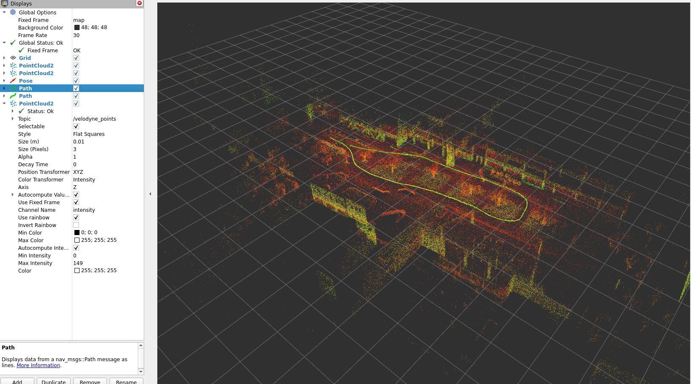
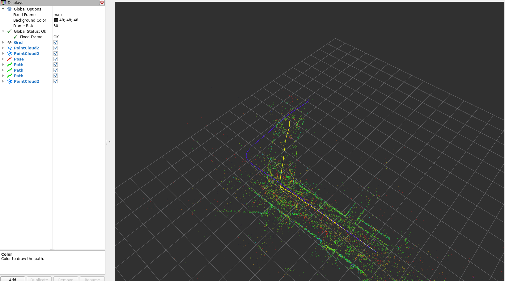
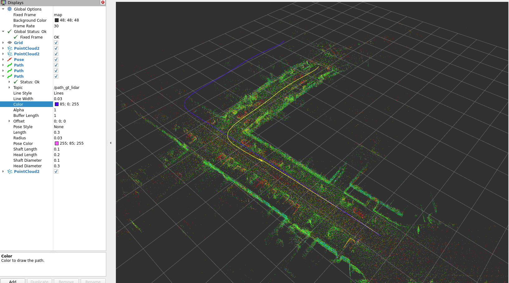
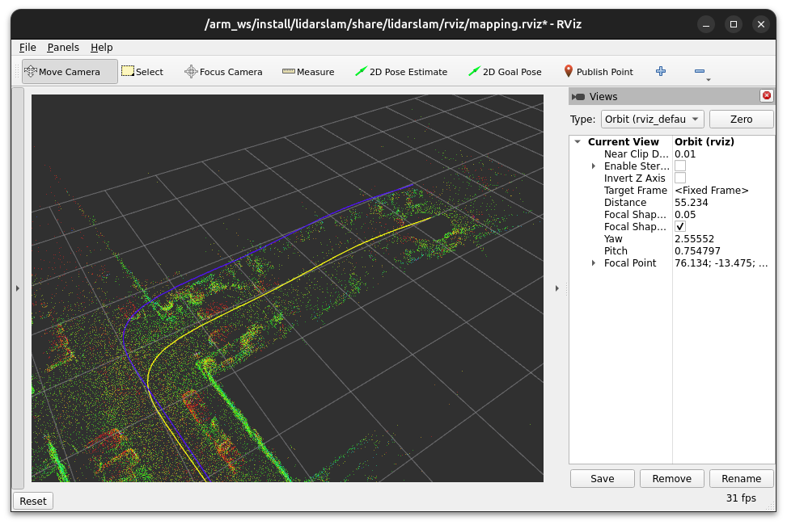

# Polecenie zadania 
Analizując dokumentację i kod źródłowy lidarslam oraz obserwując działanie systemu proszę opisać wpływ następujących parametrów z pliku `/arm_ws/src/lidarslam_ros2/lidarslam/param/lidarslam.yaml`:
## Obserwacje:
Używamy NDT jako metody dopasowania skanów, dostępne jest jeszcze GICP. Różnią się one tym, że NDT używa probabilistycznej reprezentacji przestrzeni, a GICP   dopasowuje bezpośrednio geometrię punktów z uwzględnieniem lokalnej struktury

<!-- default: -->
<!--  -->

<!-- kitty first run: -->
<!--  -->
<!-- kitty r 0.3: -->

<!-- default: -->
<!--  -->
<!-- ndt_resolution 0.001: -->
<!--  -->

<!-- # Parametry: -->

## 1. ndt_resolution (scan_matcher i graph_based_slam)
- **scan_matcher:**
- **graph_based_slam:**
- **Opis:** Rozmiar voksela w algorytmie NDT (Normal Distributions Transform)
- **Wpływ:** 
  - Wyższa wartość → szybsze dopasowanie, ale mniej dokładne
  - Niższa wartość → wolniejsze, ale precyzyjniejsze dopasowanie
  - Backend używa mniejszej wartości (1.0) dla dokładniejszego wykrywania loop closure

## 2. trans_for_mapupdate
- **Opis:** Minimalna odległość przejazdu robota wymagana do aktualizacji mapy
- **Wpływ:**
  - Większa wartość → rzadsza aktualizacja mapy, mniejsze obciążenie CPU, mniej szczegółowa mapa
  - Mniejsza wartość → częstsza aktualizacja, większa precyzja mapy, większe obciążenie obliczeniowe

## 3. map_publish_period
- **Opis:** Okres publikacji całej mapy na topic `/map`
- **Wpływ:**
  - Większa wartość → mniejsze obciążenie sieci i CPU
  - Mniejsza wartość → częstsze odświeżanie wizualizacji w RViz

## 4. scan_period
- **Opis:** Okres czasowy jednego skanu LiDAR
- **Wpływ:**
  - Krytyczny parametr dla korekcji zniekształceń chmury punktów z wykorzystaniem IMU
  - Musi odpowiadać rzeczywistej częstotliwości LiDAR (np. 10Hz = 0.1s, 5Hz = 0.2s)
  - Nieprawidłowa wartość spowoduje błędną korekcję ruchu podczas skanowania

## 5. voxel_leaf_size
- **Opis:** Rozmiar downsamplingu chmury punktów w module graph_based_slam
- **Wpływ:**
  - Większa wartość → mniejsza chmura punktów, szybsze przetwarzanie, mniej detali
  - Mniejsza wartość → więcej punktów, wolniejsze przetwarzanie, większa dokładność mapy

## 6. loop_detection_period
- **Opis:** Częstotliwość wyszukiwania pętli zamkniętych (loop closure)
- **Wpływ:**
  - Większa wartość → mniejsze obciążenie CPU, możliwe pominięcie niektórych pętli
  - Mniejsza wartość → częstsze wykrywanie pętli, większe obciążenie obliczeniowe
  - Zbyt częste wykrywanie może spowolnić system w czasie rzeczywistym

## 7. threshold_loop_closure_score
- **Opis:** Minimalny fitness score NDT wymagany do zaakceptowania loop closure
- **Wpływ:**
  - Niższa wartość → więcej wykrytych pętli, ale ryzyko fałszywych dopasowań
  - Wyższa wartość → tylko pewne pętle są akceptowane, możliwe pominięcie prawdziwych powrotów
  - Wartość ta wpływa bezpośrednio na jakość optymalizacji grafu pozycji

## 8. distance_loop_closure
- **Opis:** Minimalna odległość od aktualnej pozycji do kandydata na loop closure
- **Wpływ:**
  - Zapobiega wykrywaniu "fałszywych pętli" z ostatnimi pozycjami robota
  - Tylko pozycje oddalone o tę odległość są brane pod uwagę jako prawdziwe powroty
  - Zbyt mała wartość może powodować błędne zamknięcia pętli z bliskimi pozycjami

## 9. range_of_searching_loop_closure
- **Opis:** Promień przeszukiwania wokół aktualnej pozycji podczas szukania kandydatów na loop closure
- **Wpływ:**
  - Większy promień → więcej kandydatów, dokładniejsze wykrywanie, ale wolniejsze
  - Mniejszy promień → szybsze przetwarzanie, ale może przegapić prawdziwe pętle
  - Powinien być dostosowany do rozmiaru środowiska i dokładności odometrii

## 10. search_submap_num
- **Opis:** Liczba submap przed i po kandydacie używanych do rejestracji loop closure
- **Wpływ:**
  - Większa wartość → więcej kontekstu przestrzennego, dokładniejsze dopasowanie, wolniejsze
  - Mniejsza wartość → szybsze przetwarzanie, mniej pewne wykrywanie pętli
  - Wartość 2 oznacza użycie 2 submap przed i 2 po punkcie kandydującym (razem 5 z aktualnym)
